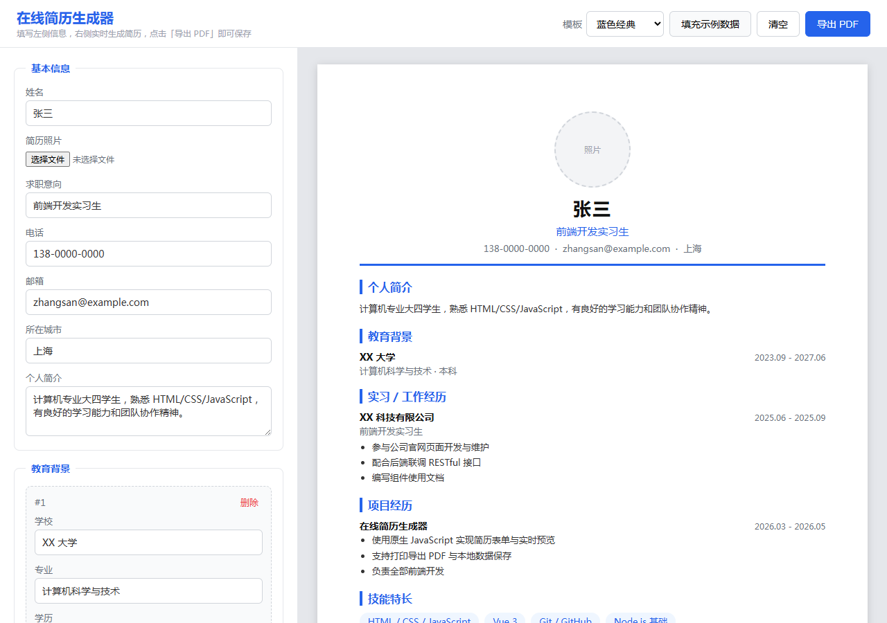
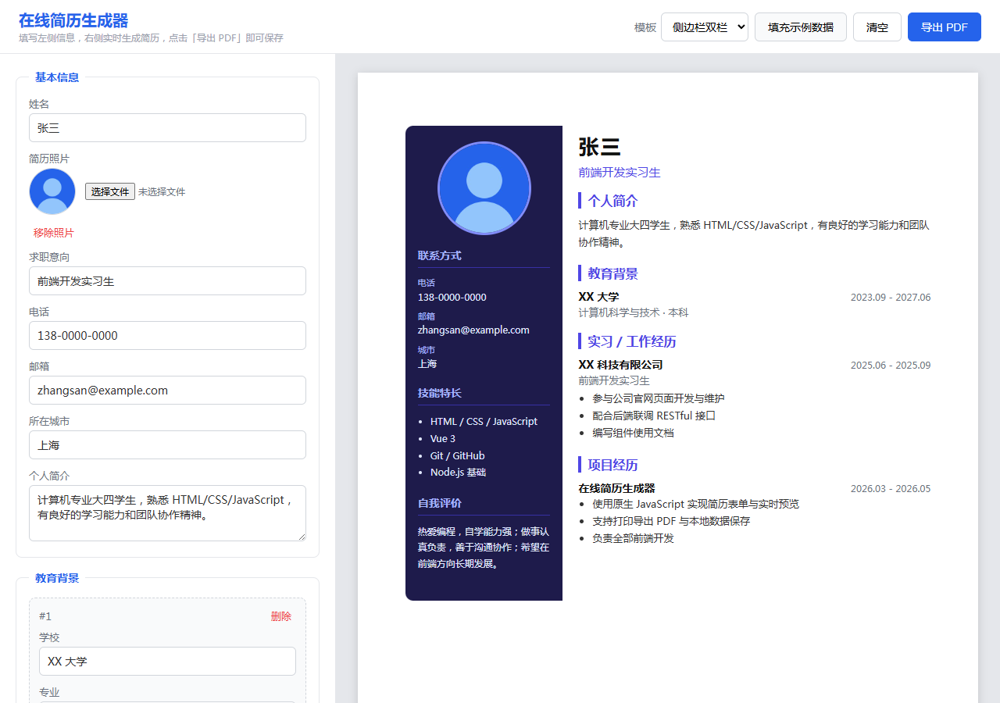

# 在线简历生成器

一个纯前端实现的在线简历制作网站：用户填写表单 → 实时生成排版好的 A4 简历 → 一键导出 PDF。

## 功能特性

- **表单录入**：基本信息、教育背景、实习/工作经历、项目经历（支持多条动态添加/删除）、技能特长、自我评价
- **实时预览**：输入即更新，A4 纸张实时渲染，空白栏目自动隐藏
- **三套简历模板**：蓝色经典 / 深色头部 / 侧边栏双栏，一键切换，切换后自动记住
- **照片上传**：自动压缩到 320px 存本地，三套模板均支持显示，可随时移除
- **导出 PDF**：调用浏览器打印，输出干净的 A4 简历（占位符自动隐藏）
- **本地保存**：所有数据存于 localStorage，刷新、关闭浏览器都不丢失

## 快速开始

### 方式一：直接使用

下载本仓库后，双击 `index.html` 即可在浏览器中使用，无需安装任何环境。

### 方式二：在线使用（GitHub Pages）

1. 将本仓库推送到 GitHub
2. 仓库 Settings → Pages → Source 选择 `main` 分支 + `/ (root)` → Save
3. 约 1 分钟后访问 `https://你的用户名.github.io/仓库名/`

## 项目结构

| 文件 | 作用 |
|---|---|
| `index.html` | 页面骨架与顶部工具栏 |
| `style.css` | 页面样式 + 三套模板样式 + 打印样式 |
| `app.js` | 表单渲染、实时预览、照片压缩、模板切换、数据保存 |
| `favicon.svg` | 浏览器标签页图标 |
| `screenshots/` | 效果截图 |
| `LICENSE` | MIT 开源协议 |

## 技术栈

原生 HTML + CSS + JavaScript，零依赖、零构建，浏览器直接运行。

## 效果截图

